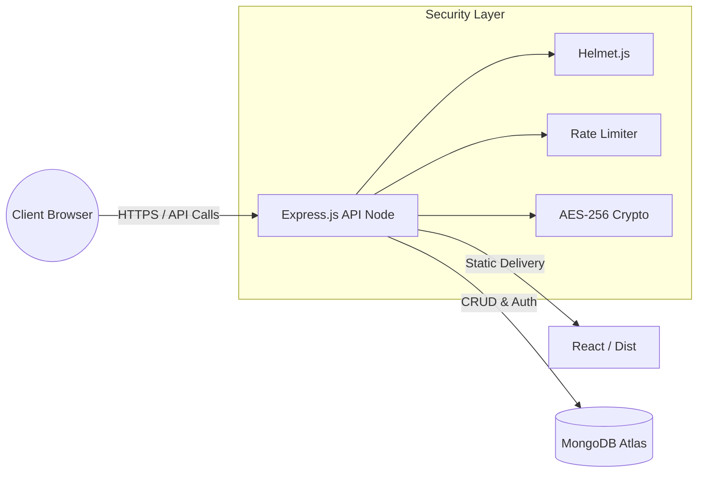

  

  <h1>📊 CashCount</h1>
  
<strong>Professional Multi-Platform Finance & Payment Tracker for Freelancers</strong>

  

    
    
    
    
  

---

## 📖 Overview

**CashCount** is an enterprise-grade, privacy-first financial tracking dashboard designed specifically for modern freelancers, independent contractors, and digital agencies. Stop relying on fragmented spreadsheets and take control of your financial ecosystem. 

Whether you're receiving wire transfers, Stripe payouts, or Payoneer deposits, CashCount acts as a unified ledger with double-entry accounting principles to give you a single source of truth for your business.

## 🚀 Key Features

- **🔐 Bank-Grade Security:** JWT-based authentication, AES-256 field-level encryption for sensitive data (SSN/Tax IDs), and Two-Factor Authentication (TOTP).
- **💸 Multi-Rail Integration:** Track inflows and withdrawals across Stripe, Payoneer, Dots, Bank Checking, and bKash.
- **📈 Double-Entry Ledger System:** Mathematically proven ledger entries running seamlessly in the background for every transaction and expense.
- **🗂 IRS-Ready Tax Prep:** Automatic categorization mapping to Schedule C deductions (Software, Workspace, Hardware, Legal fees).
- **✨ Glassmorphism UI:** Built with React 19 and Tailwind CSS v4, featuring a beautiful dark-mode, animated interface.

---

## 📸 Interface Previews

### Desktop Experience

  
  

 

  

### Mobile Experience

  
  
  

---

## 🛠️ Tech Stack

| Domain | Technology |
|---|---|
| **Frontend** | React 19, TypeScript, Tailwind CSS v4, Framer Motion, Lucide Icons |
| **Backend** | Node.js, Express, ESBuild, JWT, Bcrypt |
| **Database** | MongoDB (Native Driver + Schema Validators) |

---

## 🏗 System Architecture

CashCount is structured as a modernized monolith, enabling frictionless updates while keeping the frontend and API strictly decoupled via routing.

---

  
Designed and built for modern digital businesses.   
  <strong>© 2026 Aitijya Sarker. All rights reserved.</strong>

